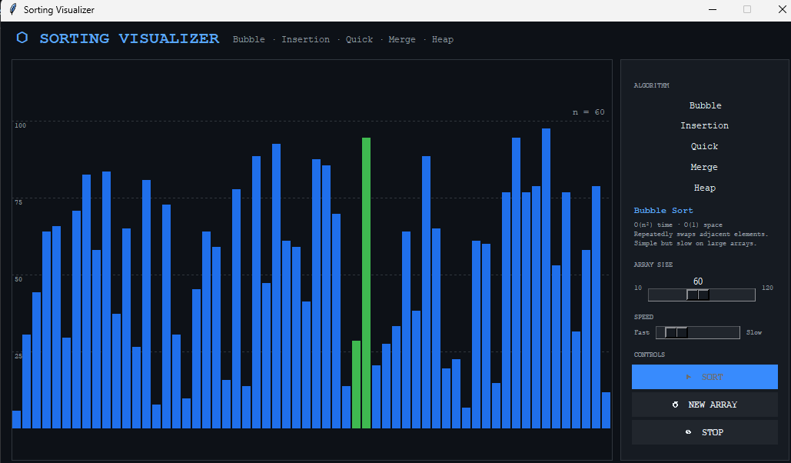
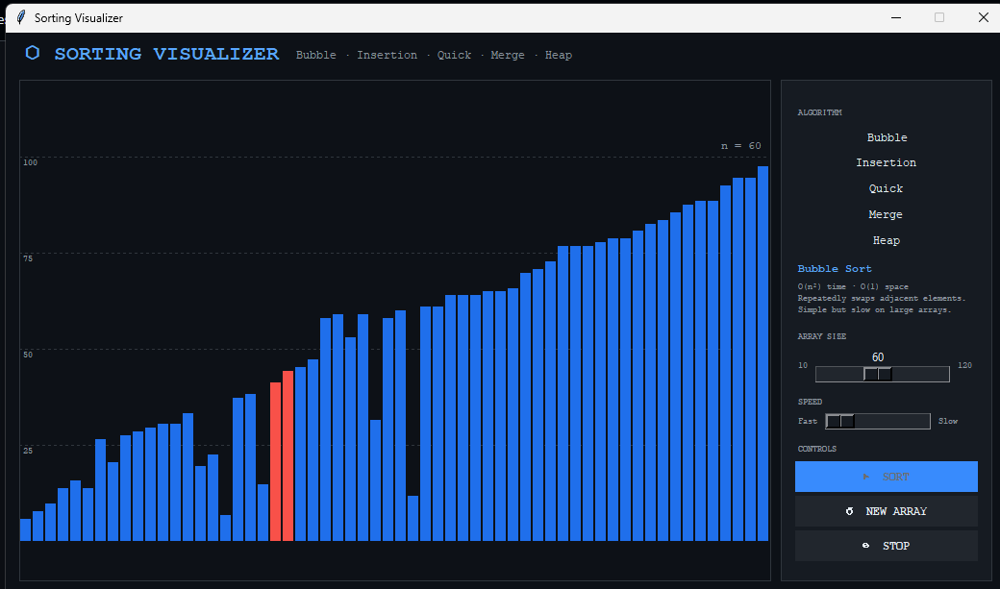

# Sorting Visualizer

An interactive desktop application built with Python and Tkinter to visualize and compare classic sorting algorithms in real time.

---

##  Features

-  Real-time visualization of sorting algorithms
-  Step-by-step animation of comparisons and swaps
-  Adjustable speed control
-  Dynamic array size (10 → 120 elements)
-  Multiple array presets:
  - Random
  - Nearly Sorted
  - Reversed
  - Few Unique Values
-  Performance metrics:
  - Number of comparisons
  - Number of swaps/writes
  - Execution time
-  Clean dark-themed UI for better visualization

---

##  Algorithms Implemented

- Bubble Sort  
- Insertion Sort  
- Quick Sort  
- Merge Sort  
- Heap Sort  

Each algorithm is implemented using generator functions to allow step-by-step visualization.

---

##  Tech Stack

- Python  
- Tkinter (GUI framework)

---

##  Preview





---

##  How to Run

1. Clone the repository:
```bash
git clone https://github.com/rilk-byte/sorting-visualizer.git
cd sorting-visualizer
```
